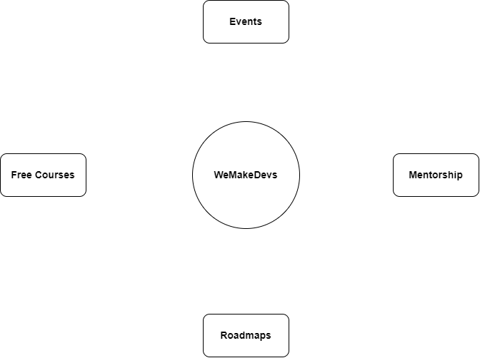

 

We Make Devs - Empowering developers to achieve their potential.

# About Us

Our community provides a variety of<b> FREE hands-on computer science training</b> and <b>workshops</b> designed to help individuals develop practical skills through hands-on learning experiences. We are committed to fostering an inclusive and supportive environment where everyone can learn and grow. Our <b>"Learn by doing"</b> approach means that you will have the opportunity to actively engage with the material and put your newly acquired skills into practice.

## What is WeMakeDevs?

We believe that every individual, regardless of their educational background and technical knowledge, possesses the potential to achieve great heights. Our initiative is founded on this very belief.

WeMakeDevs provides hands-on training courses and mentorship for free, along with a wealth of resources to help you start your journey, including <b>roadmaps, podcasts, blogs, and events.</b>

## What do we provide?

## 👨‍💻 We Make Devs

<a href="https://wemakedevs.org/" target="_blank">Visit</a> our website.

## What stack is WeMakeDevs built on?

# Connect with us

<a href="https://discord.com/invite/77xJrUBmpp"></img></a>
<a href="https://github.com/WeMakeDevs"></img></a>
<a href="https://mobile.twitter.com/WeMakeDevs"></img></a>
<a href="https://www.linkedin.com/company/wemakedevs/?originalSubdomain=in"></img></a>
<a href="https://hashnode.com/n/wemakedevs"></img></a>
<a href="https://www.instagram.com/wemakedevs/"></img></a>
<a href="https://t.me/wemakedevs"></img></a>

# Contribute

We welcome contributions in our community. 
Before making a contribution, check the <a href="https://github.com/WeMakeDevs/wemakedevs/blob/main/CONTRIBUTING.md">Contribution guide.</a>

# Code of Conduct

Check out the <a href="https://github.com/WeMakeDevs/wemakedevs/blob/main/CODE_OF_CONDUCT.md">Code of Conduct</a> to know an inclusive environment that respects all contributions.

# License

This Community is <a href="https://github.com/WeMakeDevs/wemakedevs/blob/main/LICENSE">Licensed</a> under MIT license.

## 🚀 Getting Started

These instructions will get you a copy of the project up and running on your local machine for development and testing purposes.

### 🧾 Prerequisites

Before starting, you need to install the following on your computer.

### 🛠️ Installation

1. Fork the repo
2. Clone the repository `git clone https://github.com/WeMakeDevs/wemakedevs.git`
3. Run `cd wemakedevs` to change the working directory
4. Run `npm ci` Or `npm clean-install` to install all dependencies
5. Run `npm start` to start the application
6. Visit [http://localhost:3000](http://localhost:3000) to view the application

## Thanks to all the contributors ❤️

